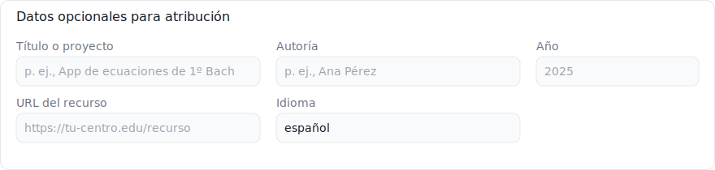

# Generador de prompt de licencias (WordPress por iframe)

Este widget HTML genera un «prompt» listo para copiar y pedir a una IA o a una persona redactora un bloque de licencia claro para tus proyectos docentes (README y página web), basándose en las licencias recomendadas en el artículo «Licencias libres para docentes: apps educativas y materiales didácticos».

## Archivos

- `index.html`: widget auto‑contenido (HTML+CSS+JS) para incrustar vía `iframe`.
- `licencias/`: resúmenes y enlaces a los textos oficiales de cada licencia incluida por defecto.

## Cómo incrustarlo en WordPress (iframe)

El archivo `index.html` debe estar accesible públicamente (en tu hosting o GitHub Pages). Luego, en WordPress:

- Abre el editor de la página/entrada y añade un bloque `HTML personalizado`.
- Pega un `iframe` apuntando a tu URL pública de `index.html`, por ejemplo:

```
<iframe
  src="https://tu-dominio.example/utilidades/licencias-libres/index.html"
  style="width:100%;min-height:680px;border:0"
  loading="lazy"
  referrerpolicy="no-referrer"
></iframe>
```

Opciones para alojarlo:
- GitHub Pages del repo `utilidades` (ruta sugerida: `/licencias-libres/index.html`).
- Hosting propio (sube la carpeta `licencias-libres/`).

## Opciones incluidas

- Tipo de recurso: `Ambos (contenidos + código)`, `Solo contenidos`, `Solo código`.
- Licencias de contenidos: `CC BY-SA 4.0` (recomendada), `CC BY 4.0`, `CC BY-NC-SA 4.0` (con reservas por ambigüedad de «NC»).
- Licencias de código: `AGPL v3` (recomendada), `MPL 2.0`, `Apache 2.0`, `MIT`.
  - Opción de enlace para la licencia del código:
    - `Crear LICENSE.txt y enlazar al archivo` (útil en proyectos de una sola página alojados fuera de GitHub).
    - `Enlazar al sitio oficial de la licencia` (sin crear LICENSE.txt).
- Presets rápidos:
  - Reciprocidad (recomendado): `CC BY-SA 4.0` + `AGPL v3`.
  - Máxima adopción: `CC BY 4.0` + `Apache 2.0`.
  - Intermedia: `CC BY-SA 4.0` + `MPL 2.0`.
- Datos de atribución (opcionales): Título/proyecto, Autoría, Año, URL, Idioma del texto generado.
  - Incluye ahora “Enlace del autor” para construir el pie de página.
  - Idiomas: español, catalán (ca), inglés (en), galego (gl), euskara (eu).

## Qué genera exactamente

Un prompt de instrucciones listo para que una IA (ChatGPT, Gemini, Claude, etc.) añada las licencias a tu proyecto en Internet, siguiendo este formato base:

Ejemplo de salida (por defecto):

```
Añade a mi app educativa las licencias recomendadas para proyectos de código y contenidos.
Para el código, aplica AGPL v3 con un archivo LICENSE.txt y notas en cada archivo de código.
Para los contenidos educativos (textos, ejercicios, vídeos, imágenes), aplica CC BY-SA 4.0 con el texto:
“Esta obra está bajo licencia CC BY-SA 4.0” y el enlace https://creativecommons.org/licenses/by-sa/4.0/.
```

### Ejemplo con datos de atribución

Los datos de atribución solo aparecen si rellenas alguno de los campos (título, autoría, año, URL):

```
Añade a mi app educativa las licencias recomendadas para proyectos de código y contenidos.

Datos para la atribución: título: App de ecuaciones, autoría: Ana Pérez, año: 2025, enlace: https://tu-centro.edu/recurso.

Para el código:
- Aplica la licencia [licencia] e incluye un archivo LICENSE.txt con el texto completo.
- Añade una nota breve al inicio de cada archivo de código indicando la licencia.
- Menciona la licencia también en la documentación del proyecto.
- En el pie de la página principal o en un lugar destacado del proyecto, incluye una mención clara a la licencia elegida para el código junto con el enlace oficial.

Para los contenidos educativos (textos, ejercicios, vídeos, imágenes):
- Aplica la licencia [licencia CC].
- En el pie de la página principal o en un lugar destacado del proyecto, añade el texto:
  “Esta obra está bajo licencia [licencia CC]” con el enlace oficial a la licencia correspondiente.
- Si es posible, acompáñalo con el icono oficial de la licencia.
```

### Captura (datos de atribución)



## Notas y criterio

- Las licencias incluidas y sus recomendaciones provienen del artículo (CC BY‑SA/CC BY/CC BY‑NC‑SA para contenidos; AGPL v3/MPL 2.0/Apache 2.0/MIT para código).
- «NC» puede generar ambigüedades; por eso aparece marcada como opción «con reservas».
- No se cargan recursos externos; funciona embebido en `iframe`.
- Puedes modificar los rótulos o añadir nuevas licencias editando el HTML: busca los `input` de radios en los `fieldset` correspondientes.
- Licenciamiento aplicado en este proyecto (ejecutando el prompt):
  - Código: GNU AGPL v3 — archivo `LICENSE.txt` y cabeceras en archivos de código (`index.html`, `img/atribucion.svg`).
  - Contenidos: CC BY-SA 4.0 — archivo `LICENSE-CONTENT.txt` con el texto requerido y enlace oficial.
  - Pie de página visible en `index.html`: “Licencia del código: AGPL v3” enlaza a `LICENSE.txt`; “Contenido: CC BY-SA 4.0” enlaza a Creative Commons.

## Personalización rápida

- Cambiar preset por defecto: en el script, función `setPreset('reciprocity')` al final; usa `adoption` o `intermediate` si prefieres otro estado inicial.
- Añadir más idiomas: añade opciones al `<select id="idioma">`.
- Ajustar texto del prompt: edita la función `buildPrompt()`.

---
Autor: Bilateria (ejemplo)
